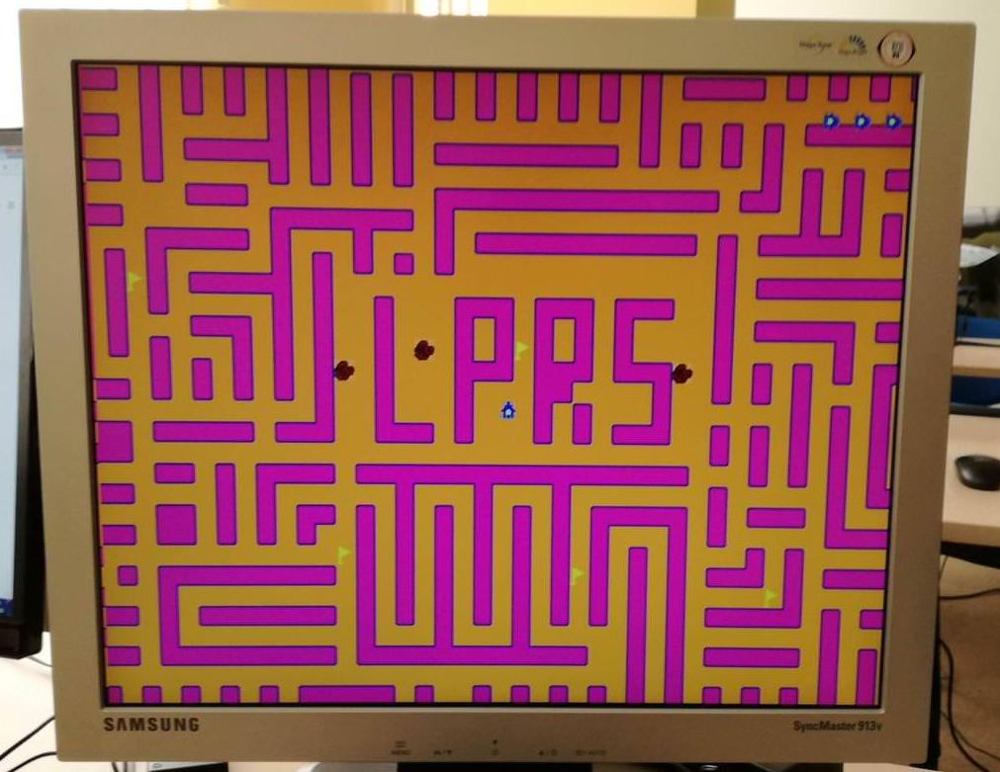

```text
Univerzitet u Novom Sadu
Fakultet tehničkih nauka
Računarska tehnika i računarske komunikacije
```

## Logičko projektovanje računarskih sistema 2
### New Rally X

U okviru predmetnog projekta potrebno je realizovati igru "New Rally X" na E2LP platformi.



Uz pomoć prošlogodišnjeg projekta, igre "Super Mario", odnosno datog hardvera, bilo je potrebno implementirati logiku igre i novu mapu, u okruženju Xilinx Platform Studio, Xilinx Softver Development Kit.

Izmene u hardveru omogućile su "smooth scrolling".
Iz matrice dimenzija 100x80 učitavamo mapu koja se sastoji od sprajtova dimenzija 16x16px. Na ekranu se u svakom trenutku prikazuje deo mape dimenzija 41x31. Igrač (autić) se kreće po mapi i skuplja zastavice. Na osnovu pozicije igrača (koordinata) i smera kretanja, detektujemo okolinu (funkcija "detekcija_okoline"). Ukoliko se u željenom smeru kretanja ne nalaze prepreke (zidovi, stene), dozvoljavamo kretanje.

Ako detektujemo:
* stenu - igrač gubi jedan život i nakon kratkog zadržavanja nastavlja igru
* zastavu - broj sakupljenih zastava se povećava za 1

Cilj je sakupiti 3 zastavice.
Igrač ima tri života.
Nakon sakupljanja tri zastavice ili gubljenja sva tri života igra kreće od početka.

### Notes
* Register (representing sprite object)
	- x_coordinate [2B]
	- Y_coordinate [2B]
	- Rotation     [1B]
	- Size&En	   [1B]
	- Pointer      [2B]
 **NOTE:** MSB - En; LSB - Size;

 * Map memory (representing map object)
	- Z_coordinate [1B]
	- Rotation	   [1B]
	- Index 	   [2B]

## Zajednički projekat

* Aleksa Rodić
* Danka Radovanović
* Nemanja Raković
* Sara Brančić
